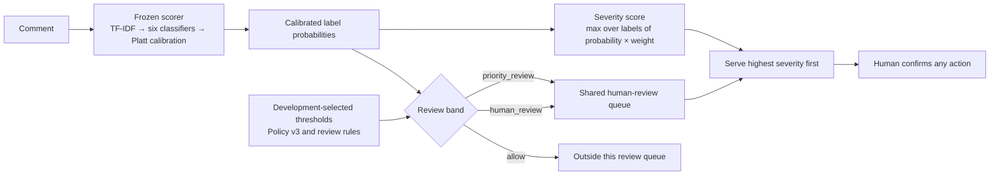
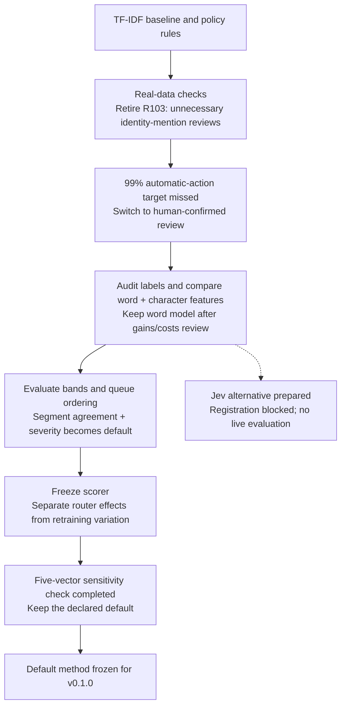

# review-router

[Experiment pages](https://xinyangwuethz.github.io/review-router/) ·
[Release v0.1.0 and downloads](https://github.com/XinyangWuEthz/review-router/releases/tag/v0.1.0) ·
[Reproduce](#reproduce)

A reproducible benchmark for human-review routing. It compares admission
policies and queue ordering with a fixed text classifier and fixed reviewer
capacity. Every moderation action requires human confirmation.

Changing the queue changes which risks reviewers reach. At 180 admitted jobs per
hour, the default severity ordering completed **53.75 more high-risk reviews and
53.75 fewer other reviews** per 8-hour shift than FIFO, averaged over 20 paired
seeds. Total completions stayed the same. This is a reallocation of review
capacity in a simulation. The [weight sensitivity record](record/severity-sensitivity.md)
contains this comparison; the generated baseline table below uses five seeds.

The project asks: **can a routing layer help reviewers reach more high-risk
comments, sooner, with the same capacity?** Its contribution is the routing and
evaluation method. The default scorer is a frozen word TF-IDF model with six
logistic classifiers and Platt calibration, trained once on Jigsaw 2018.

## Default method



- **Admission and confidence bands.** Thresholds are selected on development
  data. Priority selection requires each declared score segment above a threshold
  to meet 95% label agreement with at least 30 rows. Ordinary review uses a
  cumulative 90% target. Subgroup constraints and explicit threat/inconsistency
  rules can change the final band. These targets do not guarantee test precision.
- **Queue ordering.** Both review bands consume the same capacity. The default
  ranks by `max(p_label × weight_label)`, with weights of 10 for threat, 6 for
  identity hate, 5 for severe toxicity, 2 each for insult and obscenity, and 1 for
  toxicity. `priority_review` is a confidence/rule annotation; it does not itself
  determine queue precedence. FIFO, maximum probability and band-first ordering
  remain comparison arms.
- **Fixed scorer.** Vocabulary, IDF, classifier weights and calibration parameters
  are pinned. Router runs do not train a new model. The release fixes the scorer,
  policy, weights and threshold-selection procedure.
  Numeric thresholds are still fitted on the declared development split.

The exact method is in [the policy](review_router/policy.yaml),
[baseline config](configs/baseline.yaml) and [scorer lock](configs/frozen-baseline.json).
The [v0.1.0 method freeze](docs/release-v0.1.0.md) states the release scope and boundaries.

<!-- results:start -->
## Review-routing results

Run `20260923T125405590508Z-human-review-baseline`, evaluation commit `f19cc5b3f53b`. The baseline uses 5 shared arrival seeds; queue results are per 8-hour shift.

| Measure | Default router | Comparison or cost |
|---|---:|---|
| Sent to human review | 6312 / 63978, 9.87% | Both bands consume reviewer capacity |
| Priority-band label precision | 87.42% | 2823 comments; human confirmation required |
| High-risk labels reaching review | 84.81% | Measured against original Jigsaw labels |
| High-risk completed at 180/h | 184.6 | FIFO 134.0; probability 176.2; band-first 184.2 |
| All reviews completed at 180/h | 953.2 | FIFO 953.2; ordering redistributes capacity |
| Unfinished high-risk jobs at 180/h | 16.2 | FIFO 66.8 |

Arrival rates count admitted review jobs. High risk follows the source definition: harm proxy >= 5.0. These are simulated outcomes on an already-inspected benchmark, not measured real-world harm reduction. [Full results and qualifications](record/step6-priority.html).
<!-- results:end -->

## Gains and costs

| Choice | Observed gain | Cost or boundary |
|---|---|---|
| Severity ordering | More high-risk completions than FIFO and probability ordering under overload | At 108/h, pooled all-item p99 wait rose from 13.5 to 38.2 minutes versus FIFO. Ordering does not add capacity. |
| Segment-based priority band | Precision rose from 76.30% to 87.42% on the same scores | The band shrank from 4,624 to 2,823 comments. Total admission stayed at 6,312, so this changed neither recall nor the severity queue. |
| Word + character features, historical v2 experiment | About 15% fewer high-risk misses at matched review volume | Selected thresholds required about 12% more reviews and about 6× pipeline time. The default remains word-only. |
| Frozen scorer | Router comparisons reuse the same learned vocabulary and parameters | Full-training vocabulary tie instability remains unresolved. Exact queue comparisons reuse saved scores and arrivals. |
| Weight check, 20 seeds | At 180/h, the default completed 53.75 more high-risk jobs per shift than FIFO | It completed 53.75 fewer other jobs. Total completions stayed at 955.25; other jobs never started rose from 393.60 to 447.60. |

The feature comparison used an earlier policy and is not a new v3 result.
Evidence and qualifications are in [step 4](record/step4-features.html),
[step 6](record/step6-priority.html) and the [freeze record](record/frozen-router.md).

The separate [weight sensitivity check](record/severity-sensitivity.md) uses 20
paired seeds, compared with five in the baseline above. With scores, admissions
and evaluation weights held fixed, nonflat perturbations changed high-risk
completions by −2.15 to +2.45 per shift relative to the default at 180/h; flat
weights lost 8.35. The default is retained. This bounded check does not establish
an optimal weight vector or justify choosing the best arm after seeing results.

## How the method evolved



The [experiment record](record/index.html) preserves the attempts and their
conclusions. Jev remains untested; independent human labels for review worthiness
remain deferred.

## Reproduce

Use Python 3.12 for frozen-baseline reproduction and place the official [Jigsaw 2018](https://www.kaggle.com/c/jigsaw-toxic-comment-classification-challenge/data) files
`train.csv`, `test.csv` and `test_labels.csv` in `data/jigsaw/`.
Original comment texts are not included in the release assets.

```bash
pip install -c configs/frozen-ml.txt -e ".[ml,dev]"
gh release download v0.1.0 --repo XinyangWuEthz/review-router \
  --pattern frozen-baseline-v0.1.0.zip --dir models
python scripts/restore_frozen_model.py --archive models/frozen-baseline-v0.1.0.zip
python scripts/run_pipeline.py --config configs/baseline.yaml
```

Use `configs/dev.yaml` for threshold and ranking diagnostics without test
scoring. Runs write a manifest, policy/config snapshots, thresholds, predictions,
per-job simulation records and reports under `reports/`.
[Protocol, artifacts and CI checks](docs/experiment.md) include synthetic smoke
tests, report rendering and the explicit full-training command.

## What the benchmark establishes

The result supports this router on a fixed scorer and a stated capacity model.
Jigsaw toxicity labels are a proxy for review value; they do not independently
measure whether an ambiguous comment deserves review. This test set has been
inspected during development, so the results are an iterative benchmark. New
held-out data would be needed for independent confirmation.

The simulated arrivals, review times and severity weights are assumptions.
Overload still produces backlog. Wait summaries cover jobs that started and must
be read alongside unfinished counts. Identity-term checks do not establish
general fairness; the priority-band disparity interval is inconclusive.
Transfer to other languages, domains or changing traffic has not been evaluated.

Developed with AI-assisted tooling. Project code is licensed under [MIT](LICENSE).
Third-party dependencies and data retain their own terms. Obtain the original
corpus from [Jigsaw on Kaggle](https://www.kaggle.com/c/jigsaw-toxic-comment-classification-challenge/data)
and consult its terms before use. The project license does not replace them.
